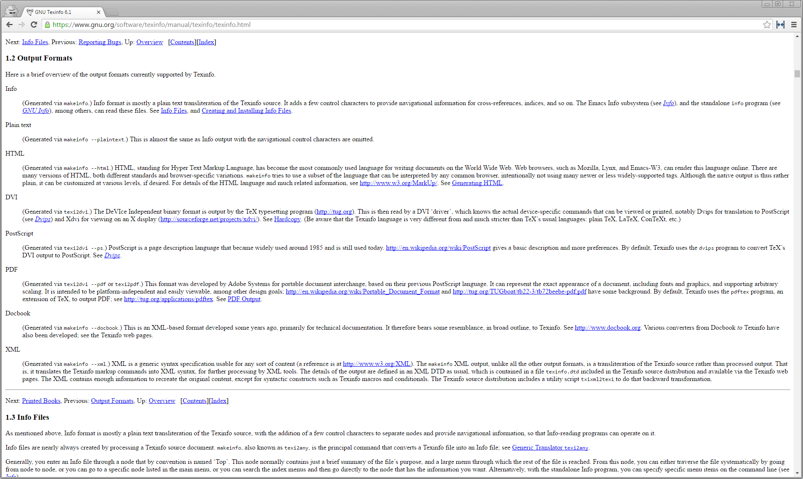
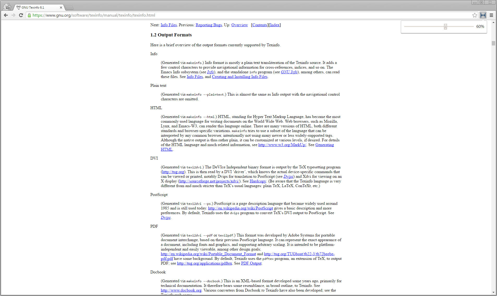
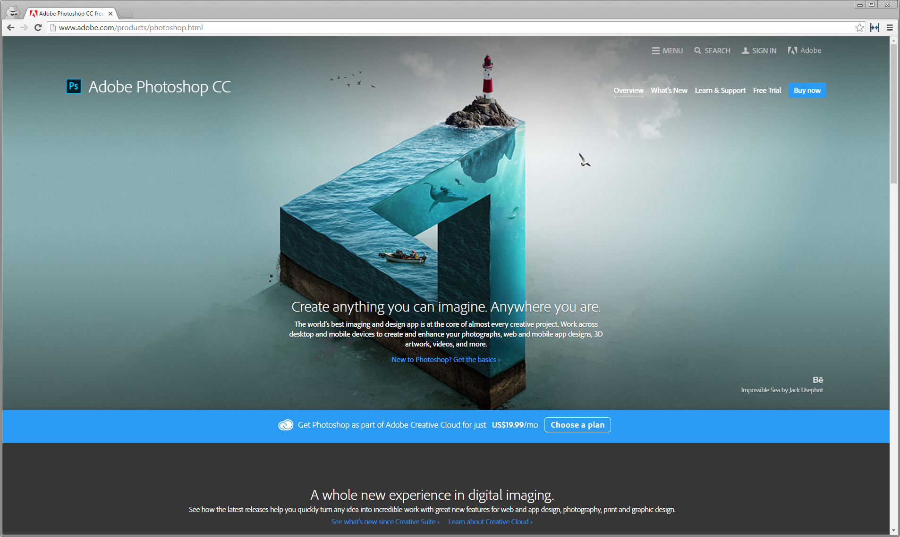
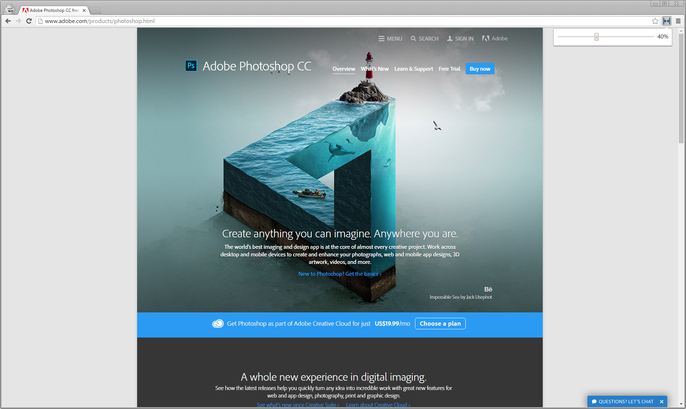

# Narrower

Narrower is a simple Chrome extension for dealing with annoyingly wide websites.
To add margins to a page, click on the extension icon and drag the slider.

You can install it from the Chrome Web Store [here](https://chrome.google.com/webstore/detail/narrower/jfjaedekncgddegockpigkkpgkhaoljg).

## Examples

Unstyled html pages often have very long lines that are hard to read.
Here is one before and after narrowing:

Wide "modern" websites can also be narrowed. Here is the [Photoshop CC](http://www.adobe.com/il_en/products/photoshop.html) website:

## Implementation

The extension adds margins to the page by changing the padding value of the document elemenet.
The selected padding value is then saved to a cookie, so it can be recalled the next time the extension is activated on the site.

## Known issues

When changing the padding value of the document element, some sites will just slide to the side, while others won't change at all.
There is no simple solution to this I am aware of, other than giving up and changing the size of the browser window.

<!--
    Notes:
        Icon color: [2B4E72](http://www.colourlovers.com/color/2B4E72/water_ends)
-->
